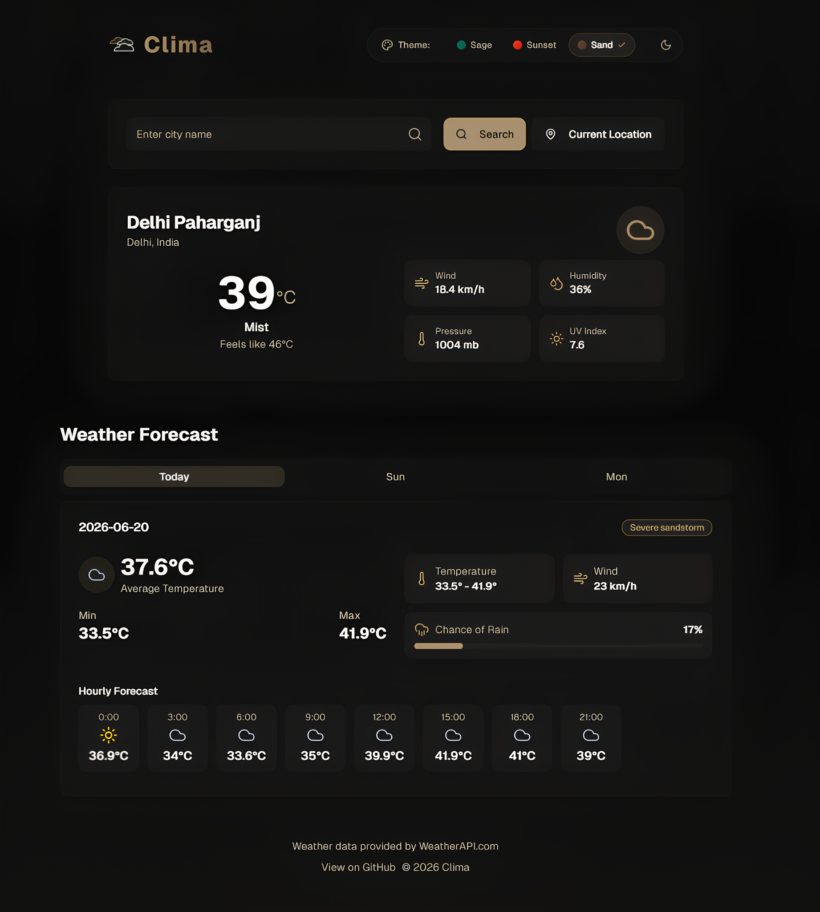

# Clima

A sleek, responsive weather application built with the [T3 Stack](https://create.t3.gg/), providing real-time weather information with beautiful UI animations and detailed forecasts.



Features

- **Real-time Weather Data**: Current conditions with detailed metrics
- **7-Day Forecast**: Comprehensive weather outlook for the week ahead
- **Hourly Predictions**: Hour-by-hour weather changes throughout the day
- **Location Search**: Find weather by city name, postal code, or geolocation
- **Responsive Design**: Optimized for all devices from mobile to desktop
- **Animated UI**: Smooth transitions and interactive elements
- **Dynamic Backgrounds**: Weather-appropriate visual themes

## 🛠️ Tech Stack

- [Next.js](https://nextjs.org) - React framework with server components
- [TypeScript](https://www.typescriptlang.org/) - Type-safe JavaScript
- [Tailwind CSS](https://tailwindcss.com) - Utility-first styling
- [Radix UI](https://www.radix-ui.com/) - Accessible UI components
- [Framer Motion](https://www.framer.com/motion/) - Animation library
- [WeatherAPI](https://www.weatherapi.com/) - Weather data provider

## 🚀 Getting Started

### Prerequisites

- Node.js 18.x or later
- npm or yarn

### Installation

1. Clone the repository:

   ```bash
   git clone https://github.com/mrd3mon/clima.git
   cd weatherapp
   ```

2. Install dependencies:

   ```bash
   npm install
   # or
   yarn install
   ```

3. Create a `.env.local` file in the root directory:

   ```
   WEATHER_API_KEY=your_weather_api_key
   ```

4. Start the development server:

   ```bash
   npm run dev
   ```

5. Open [http://localhost:3000](http://localhost:3000) in your browser.

## 📱 App Structure

- **Current Weather**: Shows temperature, condition, and key metrics
- **Weather Forecast**: Tabbed interface for daily forecasts
- **Hourly Breakdown**: Scrollable hourly weather predictions
- **Location Search**: Search bar with autocomplete suggestions

## 🧩 Components

The app is built with reusable components:

- `CurrentWeather`: Displays current weather conditions
- `Forecast`: Shows multi-day weather forecast
- `LocationSearch`: Handles location input and search
- `WeatherBackground`: Dynamic background based on conditions

## 🔧 Development

### Available Scripts

- `npm run dev` - Start development server
- `npm run build` - Build for production
- `npm run start` - Run production build
- `npm run lint` - Run ESLint
- `npm run format` - Format code with Prettier

## 🌐 Deployment

The app is optimized for deployment on:

- [Vercel](https://vercel.com) (recommended)
- [Netlify](https://netlify.com)
- [AWS Amplify](https://aws.amazon.com/amplify/)

## 🤝 Contributing

Contributions are welcome! Please feel free to submit a Pull Request.

1. Fork the repository
2. Create your feature branch (`git checkout -b feature/amazing-feature`)
3. Commit your changes (`git commit -m 'Add some amazing feature'`)
4. Push to the branch (`git push origin feature/amazing-feature`)
5. Open a Pull Request

## 📄 License

This project is licensed under the MIT License - see the LICENSE file for details.

## 🙏 Acknowledgments

- Weather data provided by [WeatherAPI.com](https://www.weatherapi.com/)
- UI components inspired by [shadcn/ui](https://ui.shadcn.com/)
- Icons from [Lucide Icons](https://lucide.dev/)
